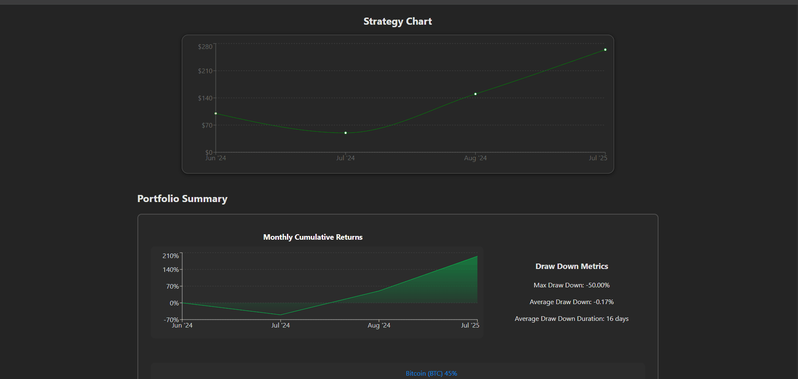

# 📊 Investment Dashboard

A full-stack Investment Dashboard built with **React** and **Django**, offering real-time strategy performance visualization, metrics tracking, asset allocation analysis, and automation for daily data syncs.

---

## 🧠 Features

- **Strategy Chart Component** — Displays a live or simulated graph  
- **Metrics Panel Component** — Includes PnL, Sharpe ratio, confidence intervals, etc.  
- **Assets Overview Component** — Shows current holdings, their weights, and PnL  
- **Control Button Component** — Toggle to start/stop the strategy  
- **Download Report Button** — Exports current metrics and asset data as CSV/PDF  

---

## 🛠️ Tech Stack

- **Frontend:** React + CSS  
- **Backend:** Django  
- **Database:** PostgreSQL  
- **Version Control & Containerization:** GitHub and Docker  
- **Deployment:** AWS EC2 and Github Actions for automation  
